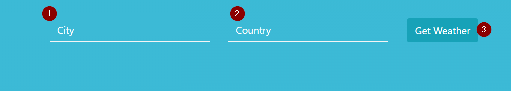
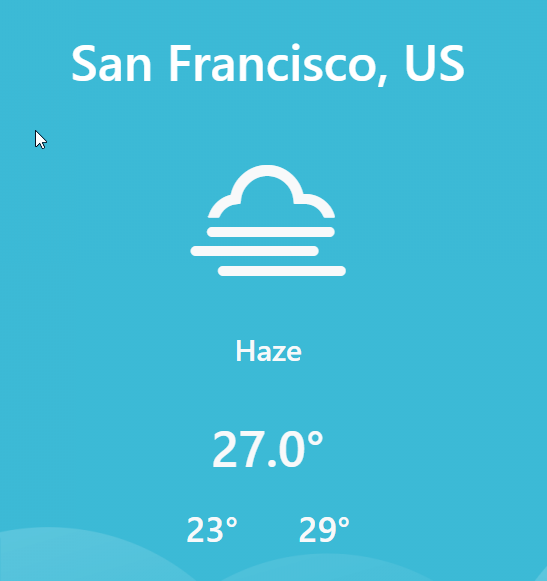

# Weather App 🌞


#### [](https://github.com/aryanmonger20/WeatherApp)

__________________________________________

An App which leverges the openweathermap API to deliver the most recent current weather in your city based on your country.

## How it works

The interface of this app is pretty straightforward and self-explenatory. All you have to do is, starting the app and filling out the needed Data

<p align="center">
 
</p>

1) Enter your City
2) Enter your Country
3) Hit the **Get Weather** button

That's it!

What you are getting afterwards is the current weather with an additonal beautiful icon which explains the current weather situation visually.

<p align="center">
 
</p>

## Work on the project locally

In order to work and run the project locally you need NodeJs and npm installed on your system.
Perform the following steps:

```
 $ git clone https://github.com/aryanmonger20/WeatherApp.git

 $ cd WeatherApp

 $ npm install

 $ npm start
```

After running this commands, open up your favorite browser (if it doesn't open automatically which usually will happen) and go to [http://localhost:3000](http://localhost:3000).


# Git Workflow for Contribution

## Fork first 🍴

We use the fork approach for collaboration. Fork the repository first and sync it with the original repository.

### Steps to keep the local version up-to-date 🔄

#### Inital setup 🛫

- Clone your forked version
  `git clone <UrlToTheForKedVersion>`

- Update the remote Url in order to sync your fork with the original repo
  `git remote add upstream https://github.com/aryanmonger20/WeatherApp.git`
  or by using ssh
  `git remote add upstream git@github.com:aryanmonger20/WeatherApp.git`
- Verify that all urls are in place
  `git remote -v`
  this should give you a output like this
  ```
    origin  https://github.com/username/master-the-event-loop.git (fetch)
    origin  https://github.com/username/master-the-event-loop.git (push)
    upstream https://github.com/aryanmonger20/WeatherApp.git (fetch)
    upstream https://github.com/aryanmonger20/WeatherApp.git (push)
  ```

#### Keep the local repository up-to-date & change into a different branch like `dev` branch 🔄

Before starting to work on the files

- Get the latest version of the dev branch
  `git pull upstream dev`
- Get the latest version of the master branch
  `git pull upstream master`
- Make sure that you made your changes always in the dev branch.
- Check in which branch you currently are
  `git branch`
  Then you will see something like this:

  ```
  * dev
  master
  ```
- If you are not in the dev branch switch to the dev branch
  `git checkout dev`
- Start hacking 💻

#### Keep the remote repository (forked version) up-to-date 🔄

- Get the latest version of the dev branch
  `git pull upstream dev`
- Get the latest version of the master branch
  `git pull upstream master`
- Push the new files to your forked version
  `git push origin dev`

## Creating PRs 🆕

In order to tell us which changes you want to make in our project, push your changes to your fork to the for example **dev branch** and create a pull request to the original repository. This makes sure that we always have a working and stable master branch after we tested your changes.
If we made our tests and the **dev branch** is stable, we will merge the **dev branch** into the master branch without closing the **dev branch**.

In order to make a PR on Github, follow this steps:

- Add your files for staging with
  `git add .` for adding all files or
  `git add <path/to/filename>` for adding specific files
- Commit your changes
  `git commit -m "commit message"`
- Push your changes to the forked version
  `git push origin dev`
- Move over to your github page and click on "Make pull request"

This project was bootstrapped with [Create React App](https://github.com/facebook/create-react-app).
